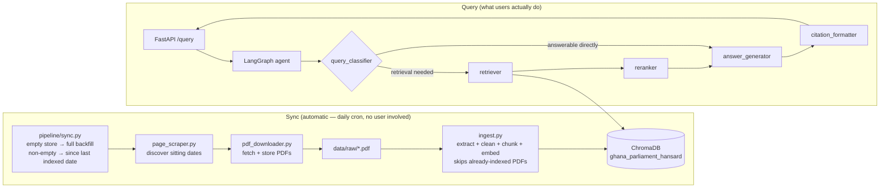

# 🏛️ Ghana Parliament Hansard RAG

A production-shaped Retrieval-Augmented Generation system over the Ghana
Parliament's Hansard (parliamentary debate) records. It scrapes published
sitting briefs, indexes them into a vector store, and answers natural-language
questions about parliamentary proceedings through an agentic LangGraph
pipeline that refuses to answer when it can't ground a response in the
actual record — built as a portfolio piece for AI/Forward-Deployed
Engineering work, and equally usable as a real civic-transparency tool.

## Architecture



The store is expected to already be populated by the time anyone queries
it — users never trigger a scrape themselves. See
[Keeping the index fresh](#keeping-the-index-fresh) below.

## Stack

| Layer | Technology |
|---|---|
| Language | Python 3.11 |
| Orchestration | LangChain + LangGraph |
| Vector store | ChromaDB (embedded, or server via docker-compose) |
| Embeddings | OpenAI `text-embedding-3-small` or local `sentence-transformers/all-MiniLM-L6-v2` |
| LLM | OpenAI, Anthropic (Claude), Mistral, or DeepSeek — whichever key is configured |
| API | FastAPI (async) |
| Frontend | Static HTML/CSS/JS (`web/`), served by FastAPI locally or standalone on Netlify |
| Scraping | `requests` (date-predictable URLs) + Selenium (listing-page discovery) |
| Containerization | Docker / docker-compose |
| CI | GitHub Actions (lint, test, docker build) |

## Quickstart

```bash
git clone https://github.com/agbozo1/gh-parliament-ai.git
cd gh-parliament-ai
cp .env.example .env
# edit .env: set at least one LLM provider key (OPENAI_API_KEY, ANTHROPIC_API_KEY,
# MISTRAL_API_KEY, or DEEPSEEK_API_KEY). EMBEDDING_PROVIDER=huggingface needs no key.

docker-compose up --build
```

Open **http://localhost:8000** for the query UI (or **http://localhost:8000/docs** for the raw Swagger API).
The `sync` service backfills the full Hansard archive on first startup —
give it a few minutes before querying (watch its logs:
`docker-compose logs -f sync`). After that, just ask a question:

```bash
curl -X POST http://localhost:8000/query \
  -H 'Content-Type: application/json' \
  -d '{"question": "What did Parliament discuss about the 2025 budget statement?"}'
```

Example response:

```json
{
  "answer": "On 11th February 2025, the Minister of Finance presented the 2025 budget statement to Parliament, covering revenue projections and planned expenditure...",
  "sources": [
    {
      "document": "11th February, 2025.pdf",
      "date": "2025-02-11",
      "url": "https://www.parliament.gh/epanel/docs/pb/11th%20February%2C%202025.pdf"
    }
  ],
  "session_id": "b3e1..."
}
```

If nothing relevant is indexed, the agent replies:
`"I could not find relevant information in the parliamentary records."`
instead of guessing.

### Keeping the index fresh

There's no manual "download this range" step for end users — the index is
expected to already be populated by the time anyone queries it:

- **First run (empty vector store):** a full backfill from
  `HANSARD_ARCHIVE_START_DATE` (default `2017-01-01`) through today.
- **Every run after that:** an incremental check — only sitting dates after
  the most recently indexed one are scraped and ingested. Nothing is
  re-downloaded or re-embedded (`run_ingest` skips PDFs already represented
  in the vector store by filename), so this is cheap to run daily.
- **How dates are found:** `pipeline.sync` first tries
  `scraper.page_scraper`'s listing-page discovery, which only requests URLs
  for sitting dates that actually have a published brief. The listing
  (`https://www.parliament.gh/docs?type=HS`) is paginated via a `P=<offset>`
  query parameter in steps of 50; discovery walks back page by page —
  reusing a single browser session — until it's covered back to the sync's
  start date, a page comes back empty, or a safety cap on page count is hit.
  Listing pages are newest-first, so a daily incremental sync only ever
  reads page 1, while the initial full backfill walks back exactly as many
  pages as the ~2,100-document archive requires and no further. If
  discovery is unavailable (no Firefox/Selenium locally, listing page
  unreachable) or doesn't reach far enough back, it falls back to
  `pdf_downloader`'s blind day-by-day probe over the range — slower (one
  request per calendar day, most 404s on an 8-year backfill) but always
  correct, so a broken/changed listing page degrades gracefully instead of
  silently skipping the backfill.

Both paths are the same function, `pipeline.sync.sync_hansards()`:

- **Docker Compose** runs it automatically via the `sync` service, once at
  startup and then every 24h (`scripts/sync_hansards.py` in a loop). In
  production, swap that loop for cron / a systemd timer / a scheduled
  GitHub Actions workflow hitting `POST /ingest` — the loop just avoids
  requiring an external scheduler for `docker-compose up` to work.
- **Manual trigger** (e.g. to seed data immediately instead of waiting for
  the first daily run): `POST /ingest`, no body needed. Poll
  `GET /ingest/{job_id}` for status.
- **Freshness check:** `GET /health` reports `latest_sitting_date` — also
  shown in the UI's status bar — so you can see at a glance how current the
  index is without triggering anything.

### Local (no Docker)

```bash
pip install -r requirements.txt
uvicorn api.main:app --reload

# in a second terminal — do this once to seed data before querying
python -m scripts.sync_hansards
```

Without `CHROMA_HOST` set, ChromaDB runs embedded and persists to `data/chroma/`.
FastAPI serves the frontend at `/` from the same process — no separate dev server needed.

The full backfill (first run, ~8 years back by default) can take a while —
it's making one real HTTP request per discovered sitting date (or per
calendar day, in the blind-probe fallback), so let it run in a dedicated
terminal rather than waiting on it inline:

```bash
python -m scripts.sync_hansards
```

For ongoing freshness without Docker's `sync` service, schedule that same
command via cron (macOS/Linux) or Task Scheduler (Windows). Example:
daily at 6am, logging output so you can check it ran:

```bash
crontab -e
# add a line like:
0 6 * * * cd /path/to/gh-parliament-ai && /path/to/venv/bin/python -m scripts.sync_hansards >> data/sync.log 2>&1
```

Use absolute paths for both the repo and the venv's `python` — cron runs
with a minimal environment, so a bare `python` on `PATH` won't resolve to
your virtualenv.

### Frontend (`web/`)

A minimal, dependency-free HTML/CSS/JS query UI — no build step, no framework.
FastAPI mounts it at `/` automatically whenever the `web/` directory is present,
so `uvicorn api.main:app` alone gets you a working UI locally.

To host it separately (e.g. **Netlify**, decoupled from the API — see
[Known limitations](#known-limitations--next-steps)):

1. Point Netlify at this repo with `netlify.toml` already set to
   `publish = "web"` — no build command needed.
2. Deploy the API itself elsewhere (Render/Fly.io/Railway/your own Docker host).
3. Edit `API_BASE` at the top of `web/app.js` to that API's URL before deploying
   (it defaults to same-origin, which only works when FastAPI serves both).

### Tests

```bash
pytest tests/ -v
```

No API keys are required — the LLM and vector store are mocked/stubbed in tests.

## Design decisions

**Why LangGraph over a single `RetrievalQA` chain.** A plain chain always
retrieves, always answers, and has no way to refuse. The graph adds a
routing step (skip retrieval for chit-chat), a reranking step (drop
low-relevance chunks before they reach the answer prompt), and a hard
refusal path when nothing relevant survives reranking — the single
highest-priority requirement for a system answering questions about
government records, where a confident hallucination is worse than "I
don't know."

**Why ChromaDB.** Local-first and file-persisted for zero-ops development,
but the same code talks to a server (`CHROMA_HOST`/`CHROMA_PORT`) for a
docker-compose or hosted deployment — no code change between environments,
and native metadata filtering (`date`, `session_id`) supports scoped
queries without a second index.

**Chunking strategy.** `RecursiveCharacterTextSplitter` at
`chunk_size=800, chunk_overlap=100`. Hansard text is dense, formal prose;
800 characters keeps a chunk to roughly one exchange or statement without
fragmenting mid-sentence as often as a smaller size would, and the overlap
prevents cutting a quoted figure or name across a chunk boundary.

**Multi-provider LLM selection.** Rather than hard-coding one vendor, the
app reads whichever of `OPENAI_API_KEY` / `ANTHROPIC_API_KEY` /
`MISTRAL_API_KEY` / `DEEPSEEK_API_KEY` is present and builds the matching
LangChain chat model; with several keys set it picks one at random per
process (or pin one via `LLM_PROVIDER`). This keeps the app deployable
wherever a key happens to be available, including free-tier-only
environments.

**Ingestion is automatic, not a user action.** Earlier iterations exposed a
manual "pick a date range and download" control to end users. That couples
query latency to scrape latency (Selenium + PDF parsing + embedding, all in
the request path) and puts an ops concern in front of people who just want
to ask a question. Instead, `pipeline.sync.sync_hansards()` keeps the store
current on its own — full backfill once, incremental catch-up daily — so a
query only ever has to do retrieval, never a fetch. `POST /ingest` still
exists for ops (force a sync now instead of waiting for the schedule), but
it takes no parameters; there's no date range for a user to get wrong.

## Known limitations & next steps

- **Netlify hosting**: Netlify's serverless functions aren't a good fit for
  a stateful FastAPI app with a persistent vector store and a LangGraph
  agent loop — Netlify works well for the docs/marketing surface, but the
  API itself is best run on a container host (Render, Fly.io, Railway, or
  the included Dockerfile on any VM) with the `chromadb` service pointed at
  a persistent volume.
- The scraper's `page_scraper.py` assumes a listing page exists at a
  predictable path; if the Parliament site's structure changes, the
  date-based `pdf_downloader` fallback still works for known date ranges.
- Reranking is LLM-scored rather than a dedicated cross-encoder — cheaper
  to run, but adds one LLM call per candidate chunk. A local
  `sentence-transformers` cross-encoder would cut latency and cost at the
  expense of another model dependency.
- `/ingest` (and the `sync` service's scheduled runs) execute in a
  background thread with in-memory job tracking; a restart loses in-flight
  job status, and the docker-compose `sync` loop is a `sleep 86400` loop,
  not a real scheduler — fine for one instance, not for multiple replicas.
  A real deployment would move this to cron/a scheduled GitHub Actions
  workflow calling `POST /ingest`, or a task queue (Celery/RQ) with
  persistent job state.
- No authentication on the API — add it before exposing this beyond local/demo use.

## Credits

Built on publicly available records from the
[Parliament of Ghana](https://www.parliament.gh) to promote transparency
and civic engagement.

by: Ebenezer Agbozo, PhD.
